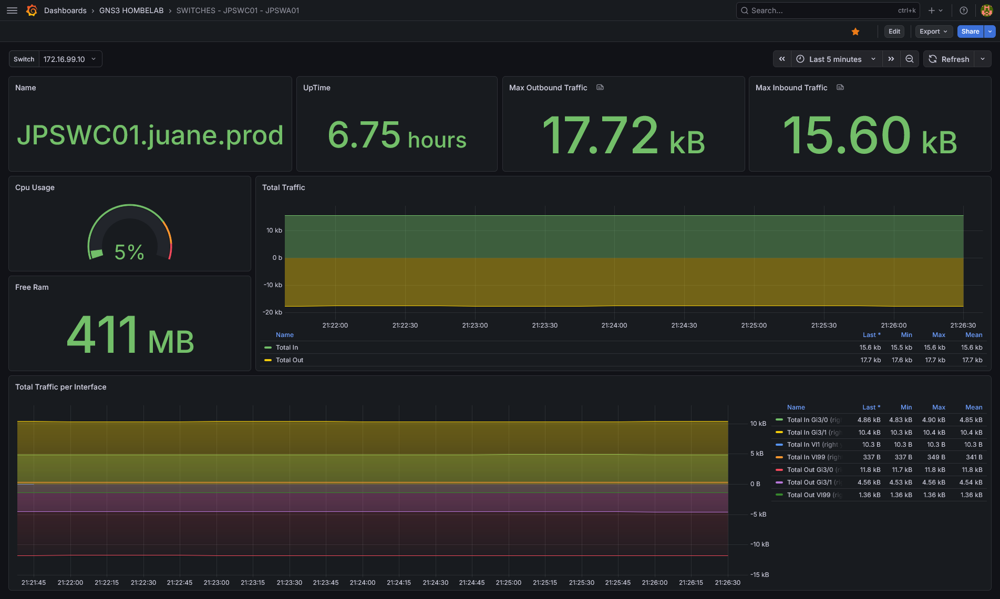
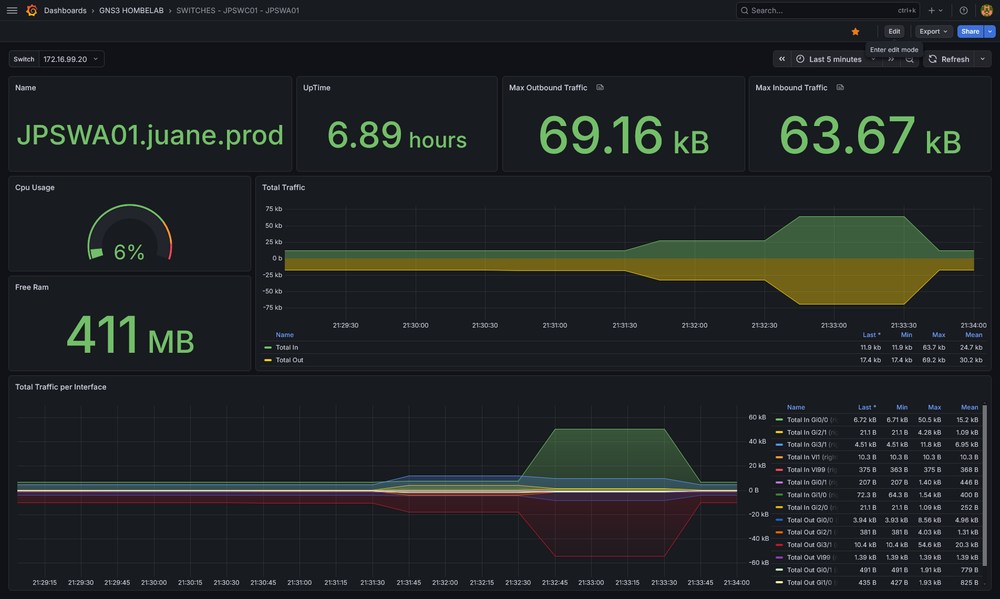

# :octicons-meter-16: Grafana & Prometheus

> **URL de Acceso:** `https://grafana.js-lab-uy.duckdns.org`

Este stack proporciona **Observabilidad** de la red. A diferencia de Uptime Kuma (que solo verifica si un equipo responde), este sistema recolecta métricas históricas detalladas: consumo de ancho de banda, carga de CPU por núcleo, uso de memoria RAM y estabilidad de las peticiones SNMP.

Este servicio se ejecuta en una instancia de **Oracle Cloud Infrastructure (OCI)**, fuera de la red local en GNS3 del laboratorio.
    
La conexión con los dispositivos locales se realiza a través de un túnel **Tailscale**.

## 1. Propósito (Observabilidad Detallada)
Grafana y Prometheus nos permiten ir más allá de un simple "UP/DOWN". Podemos visualizar tendencias históricas, identificar picos de tráfico, monitorear la salud de los dispositivos y detectar anomalías en el rendimiento.
Prometheus actúa como el sistema de recolección y almacenamiento de métricas, mientras que Grafana se encarga de la visualización y creación de dashboards personalizados.

## 2. Arquitectura de Red

* **No hay puertos expuestos a Internet:** Los puertos 3000 (Grafana) y 9090 (Prometheus) no están abiertos en el firewall de Oracle.
* **Acceso Público y VPN:** Para ver los dashboards en grafana se expone publicamente el endpoint `https://grafana.js-lab-uy.duckdns.org`, mientras que para acceder a prometheus y snmp exporter, es obligatorio estar conectado a la red Tailscale.
* **Recolección de Datos:** Prometheus (en la nube) alcanza las IPs privadas de la LAN (`192.168.1.x`) enrutando el tráfico a través del nodo Tailscale local (Subnet Router).

## 3. Dashboards Personalizados
Se han creado dashboards personalizados en Grafana para visualizar métricas clave de los dispositivos de red:


*Switch Core (JPSWC01) - Métricas de rendimiento*


*Switch Acceso (JPSWA01) - Métricas de rendimiento*

!!! info
    Estos dashboards muestran métricas como el tráfico de interfaces, nombre del dispositivo, memoria RAM utilizada, uso del CPU, tiempo de encendido y maximos picos de entrada y salida de tráfico. Esto nos permite monitorear la salud y el rendimiento de los dispositivos en tiempo real y a lo largo del tiempo, facilitando la identificación de problemas potenciales antes de que se conviertan en críticos.

## 4. Despliegue (Docker) y Configuración
Grafana y Prometheus se ejecutan como contenedores Docker en una instancia de Oracle Cloud
Infrastructure (OCI). La configuración de cada servicio se gestiona a través de archivos `docker-compose.yml` y archivos de configuración específicos para Prometheus y Grafana.

```yaml title="docker-compose.yml"
services:
  prometheus:
    image: prom/prometheus:v3.9.1
    container_name: prometheus
    ports:
      - 9090:9090
    volumes:
      - ./prometheus:/etc/prometheus
      - ./prometheus-data:/prometheus
    command: "--config.file=/etc/prometheus/prometheus.yml"
    restart: unless-stopped
    networks:
      - monitoring_network

networks:
  monitoring_network:
    driver: bridge
    name: monitoring_network
```
### 4.1 Configuración de Prometheus
El archivo `prometheus.yml` define los "targets" que Prometheus monitorea. En este caso, se han configurado targets para monitorear los dispositivos de la red local a través del nodo Tailscale:
```yaml
global:
  scrape_interval: 30s

scrape_configs:
  # JOB 1: Equipos VyOS y PfSense
  - job_name: 'Vyos and PfSense'
    scrape_interval: 60s      # Escanea cada 1 minuto (menos carga al CPU de GNS3)
    scrape_timeout: 30s       
    static_configs:
      - targets:
        - 10.255.255.1  
        - 192.168.1.1   
    metrics_path: /snmp
    params:
      auth: [public_v2]
      module: [nix_device]
    relabel_configs:
      - source_labels: [__address__]
        target_label: __param_target
      - source_labels: [__param_target]
        target_label: instance
      - target_label: __address__
        replacement: snmp-exporter:9116

  # JOB 2: Equipos Cisco
  - job_name: 'Router Cisco'
    static_configs:
      - targets:
        - 10.255.255.2
    metrics_path: /snmp
    params:
      auth: [public_v2]
      module: [cisco_device]
    relabel_configs:
      - source_labels: [__address__]
        target_label: __param_target
      - source_labels: [__param_target]
        target_label: instance
      - target_label: __address__
        replacement: snmp-exporter:9116

# JOB 3: Equipos Cisco
  - job_name: 'Switches Cisco'
    scrape_interval: 60s      
    scrape_timeout: 30s       
    static_configs:
      - targets:
        - 172.16.99.10
        - 172.16.99.20
    metrics_path: /snmp
    params:
      auth: [public_v2]
      module: [cisco_device]
    relabel_configs:
      - source_labels: [__address__]
        target_label: __param_target
      - source_labels: [__param_target]
        target_label: instance
      - target_label: __address__
        replacement: snmp-exporter:9116
```

!!!info 
    los parametros targets corresponden a las IPs privadas de los dispositivos en la LAN, que Prometheus alcanza a través del nodo Tailscale local (Subnet Router). El módulo `nix_device` se utiliza para VyOS y PfSense, mientras que el módulo `cisco_device` se aplica a los dispositivos Cisco.

### 4.2 Configuración del SNMP Exporter
El SNMP Exporter es el componente que traduce las consultas SNMP a métricas que Prometheus puede recolectar. Se ejecuta en un contenedor Docker separado en el puerto 9116 y actúa como intermediario entre Prometheus y los dispositivos de red.
```yaml title="docker-compose.yml"
services:
  snmp-exporter:
    container_name: snmp-exporter
    image: prom/snmp-exporter:v0.30.1
    ports:
      - 9116:9116
    volumes:
      - ./config:/etc/snmp-exporter
    command: --config.file=/etc/snmp-exporter/snmp.yml
    restart: unless-stopped
    networks:
      - monitoring_network

networks:
  monitoring_network:
    external: true
```

!!! note
    El archivo `snmp.yml` define los módulos de SNMP para diferentes tipos de dispositivos. Por ejemplo, el módulo `cisco_device` incluye OIDs específicos para recolectar métricas de routers y switches Cisco, mientras que el módulo `nix_device` se enfoca en métricas relevantes para VyOS y PfSense.

### 4.3 Configuración de Grafana
Grafana también se despliega como un contenedor Docker y se conecta a la misma red docker de Prometheus para acceder a las métricas.

```yaml title="docker-compose.yml"
services:
  grafana:
    image: grafana/grafana:12.4.0-20904407122-ubuntu
    container_name: grafana
    restart: unless-stopped
    ports:
      - '3000:3000'
    environment:
      GF_RENDERING_SERVER_URL: http://grafana-image-renderer:8081/render
      GF_RENDERING_CALLBACK_URL: http://grafana:3000/
    volumes:
      - grafana-storage:/var/lib/grafana

    networks:
      - monitoring_network
volumes:
  grafana-storage: {}

networks:
  monitoring_network:
    external: true
```

## 5. Conceptos Clave:
* **SNMP Exporter:** Componente que traduce las consultas SNMP a métricas que Prometheus puede recolectar, permitiendo monitorear dispositivos de red que solo exponen métricas a través de SNMP.
* **OID (Object Identifier):** Identificadores únicos utilizados en SNMP para referirse a métricas específicas de dispositivos de red.
* **MIBs (Management Information Base):** Estructuras de datos que describen las métricas disponibles en un dispositivo SNMP, organizadas jerárquicamente bajo OIDs.
* **Módulos de SNMP:** Configuraciones específicas en el SNMP Exporter que definen qué OIDs consultar para diferentes tipos de dispositivos (ej. `cisco_device` para Cisco, `nix_device` para VyOS/PfSense).